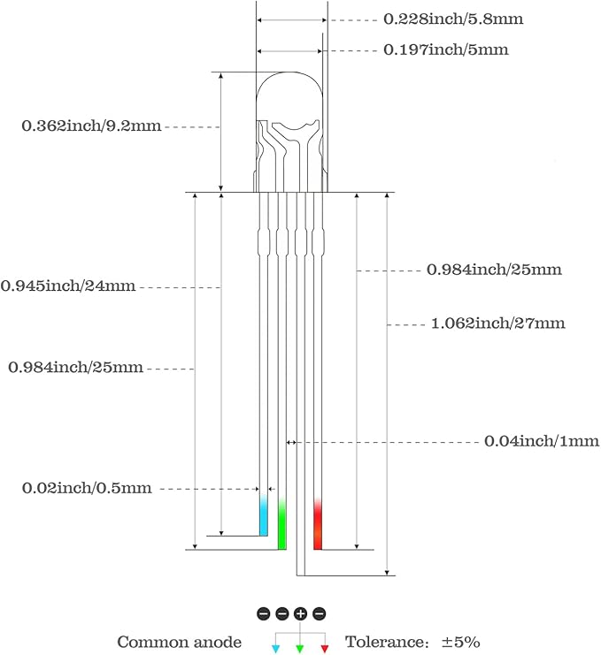
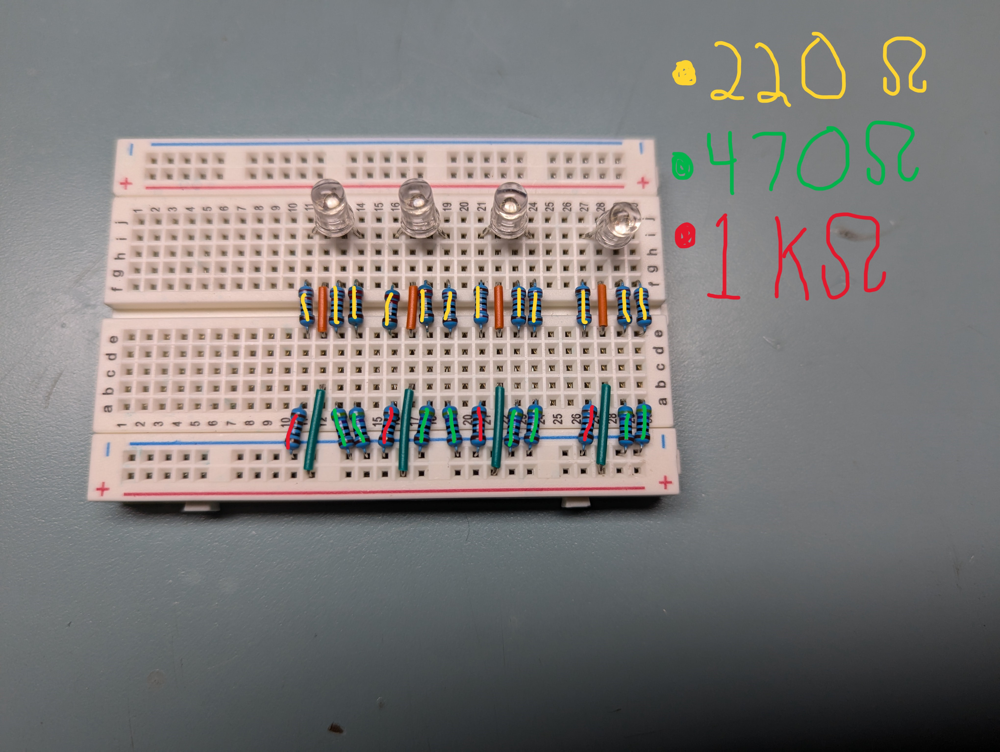
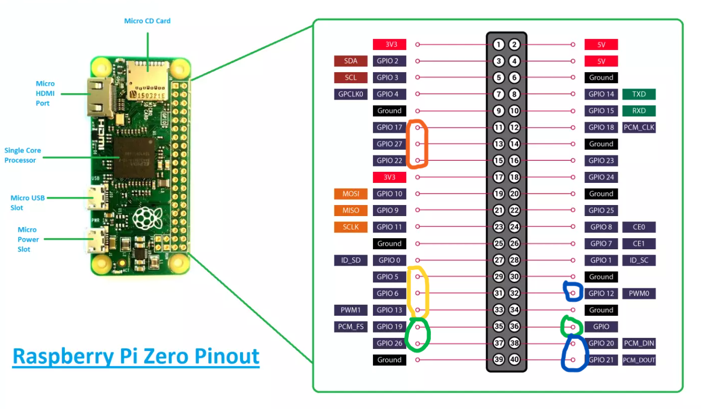
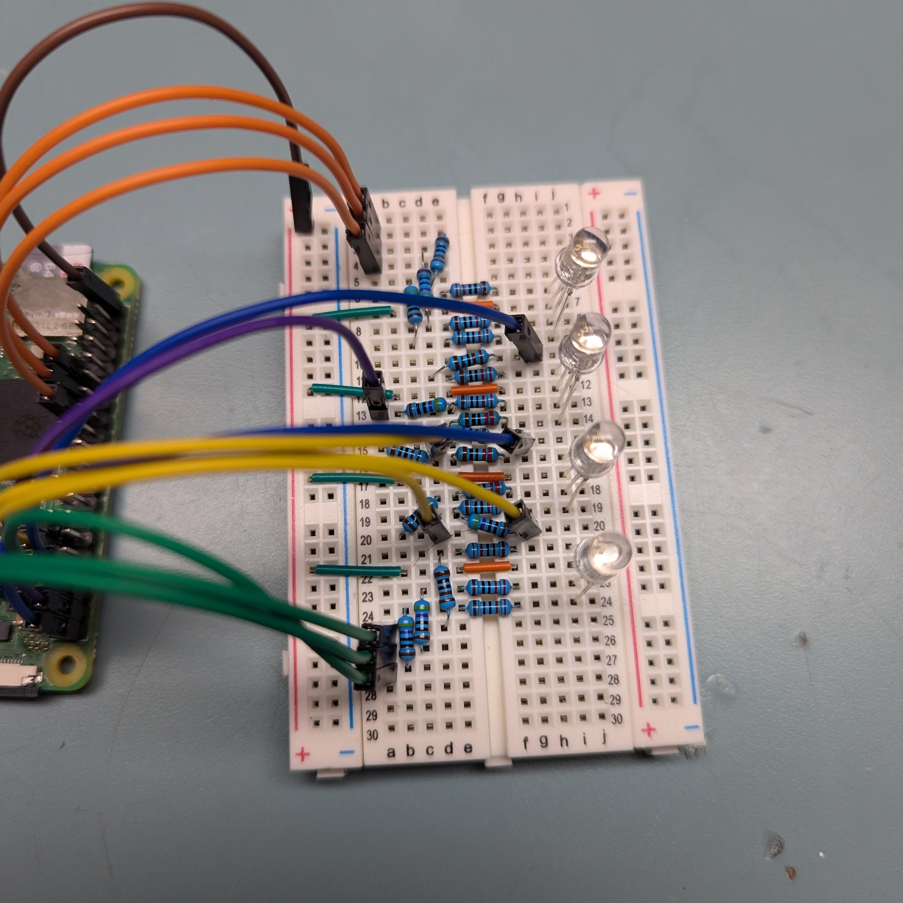

# Dumpster Fire - Flame With Flickering LEDs

## Project Description


This is the code portion of a project I am doing for a 3D printing contest entry. The code is meant to activate several RGB LEDs to create a flickering, flame-like effect.

## Supplies

### Supply List

| Item                   | Qty | Link        |
| ---------------------- | --- | ----------- |
| 3D Print File          | 1   | Creality    |
| Raspberry Pi           | 1   | Microcenter |
| Solderless BreadBoard  | 1   | Amazon      |
| Dupont M-F Cables      | 14  | Amazon      |
| 220 Ohm Resistor       | 12  | Amazon      |
| 470 Ohm Resistor       | 8   | Amazon      |
| 1K Ohm Resistor        | 4   | Amazon      |
| RGB LED (Common Anode) | 4   | Amazon      |

### Choosing an LED - Common Cathode vs Common Anode

You will find that there are two main types of RGB LEDs out there. The type you buy will affect the way the device needs to be wired and coded.

**I used a common ANODE LED for this project.** I will make some notes later on regarding what changes to make if you are using a common cathode LED.



## Circuit and Power

I will use the 5V rail on the RPi, and divide it into one parallel circuit for each LED to connect to the anode. I will run the RPi pins to the ground pins of each LED individually.

**IMPORTANT: USE THE CORRECT RESISTOR VALUES TO AVOID DAMAGE TO YOUR PI!** The Rapsberry Pi comes with current limitations. Each GPIO pin should only carry a maximum of **16mA**, and the total GPIO should not carry a current greater than **50mA**.

### RGB LED Resistor Values:

**Red: 1220 Ohms** ((5V-2V)\1220 = 0.0025mA)  
**Green: 690 Ohms** ((5V-3.2V)\690 = 0.0026mA)  
**Blue: 690 Ohms**((5V-3.2V)\690 = 0.0026mA)

**Total Current Through GPIO: ~30mA**



### Pin Out

| LED Name  | Pin |
| --------- | --- |
| RED_LED_1 | 17  |
| GRN_LED_1 | 27  |
| BLU_LED_1 | 22  |
| RED_LED_2 | 5   |
| GRN_LED_2 | 6   |
| BLU_LED_2 | 13  |
| RED_LED_3 | 19  |
| GRN_LED_3 | 26  |
| BLU_LED_3 | 16  |
| RED_LED_4 | 12  |
| GRN_LED_4 | 20  |
| BLU_LED_4 | 21  |



**_Note, because I used a common ANODE LED I am running power from the 5V rail to the anode of the LED. If you were to use a common cathode, you would need to run the cathode to a ground pin on the Pi._**



## Setting up the Raspberry Pi

### Setup Instructions

If you have never used a Raspberry Pi before, here are some resources I have created over the years that may be helpful for you.

**[My GitHub - Setting up a Raspberry Pi]**(https://github.com/DavidMiles1925/pi_zero_setup?tab=readme-ov-file#setting-up-raspberry-pi-zero)

**[My YouTube - Setting up a Raspberry Pi]**(https://youtu.be/PFzUDpfFmyg)

### Installing Git

Run this code from your terminal.

```bash
sudo apt install git
git config --global user.email "you@example.com"
git config --global user.name "Your Name"
```

## Downloading and Running the Code

**1. Clone the Repository**

Run this command from your home folder to clone the repository:

```bash
git clone https://github.com/DavidMiles1925/flame_led_light.git
```

**2. Set up `config.py`**

You can edit `config.py` with the command:

```bash
sudo nano config.py
```

When you are finished press Ctrl+S followed by Ctrl+X to save and exit.

Adjust `FLICKER TIME` to set the time (in seconds) between light changes. The default is 0.05 seconds.

If you use different pins than this tutorial specifies, you'll need to update the pin numbers in `config.py`.

**3. Modify code if needed for common cathode**

Remove (or comment out) lines 21-27 in `main.py`. Un-comment lines 13-18 of the code.

**4. Test the code**

Navigate into the program's directory. From there, run the command:

```bash
sudo python main.py
```

Debug for your set up if necessary.

**5. Set the program to run on startup**

You'll need to edit your `rc.local` file on your Raspbery Pi. Add this line to the file before the `exit` code. Replace YOUR_PI_NAME with the name of your Pi.

```bash
sudo python /home/YOUR_PI_NAME/flame_led_light &
```

**DO NOT FORGET THE "&" AT THE END!**

## 3D Print

Info to come
