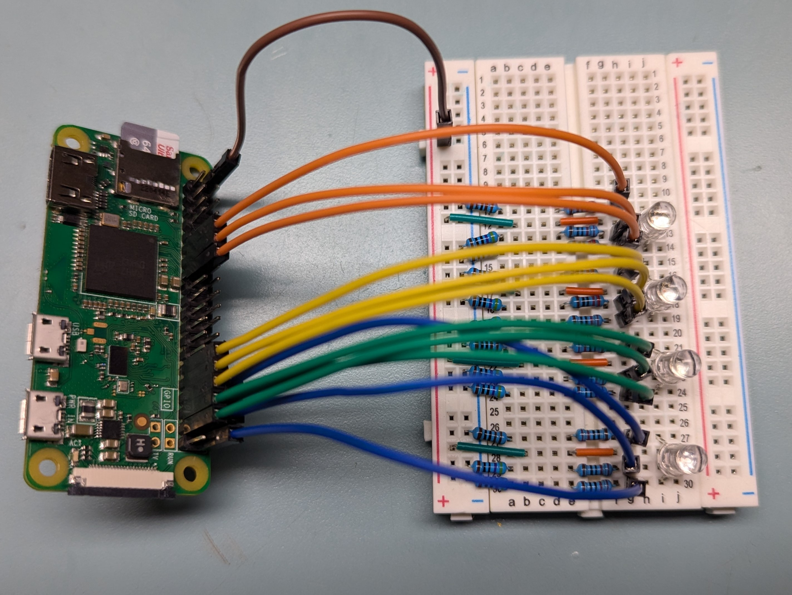

# Flame With Flickering LEDs

## Project Description

This is the code portion of a project I am doing for a 3D printing contest entry. The code is meant to activate several RGB LEDs to create a flickering, flame-like effect.

## Documentation

### Circuit Power

I will use the 5V rail on the RPi, and divide it into one parallel circuit for each LED to connect to the anode. I will run the RPi pins to the ground pins of each LED individually.

**IMPORTANT:** The Rapsberry Pi comes with current limitations. Each GPIO pin should only carry a maximum of **16mA**, and the total GPIO should not carry a current greater than **50mA**. **USE THE CORRECT RESISTOR VALUES TO AVOID DAMAGE TO YOUR PI**

#### RGB LED Resistor Values:

**Red: 1220 Ohms** ((5V-2V)\1220 = 0.0025mA)  
**Green: 690 Ohms** ((5V-3.2V)\690 = 0.0026mA)  
**Blue: 690 Ohms**((5V-3.2V)\690 = 0.0026mA)

**Total Current Through GPIO: ~30mA**

### Pin Out

| LED Name  | Pin |
| --------- | --- |
| RED_LED_1 | 17  |
| GRN_LED_1 | 27  |
| BLU_LED_1 | 22  |
| RED_LED_2 | 5   |
| GRN_LED_2 | 6   |
| BLU_LED_2 | 13  |
| RED_LED_3 | 19  |
| GRN_LED_3 | 26  |
| BLU_LED_3 | 16  |
| RED_LED_4 | 12  |
| GRN_LED_4 | 20  |
| BLU_LED_4 | 21  |

